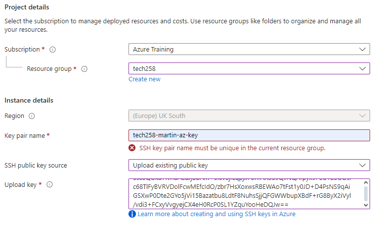
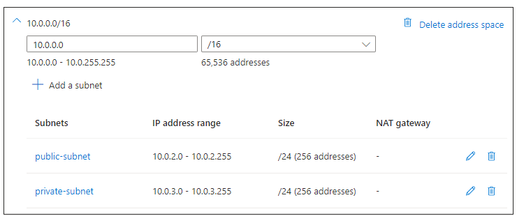
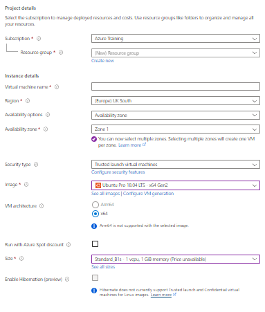
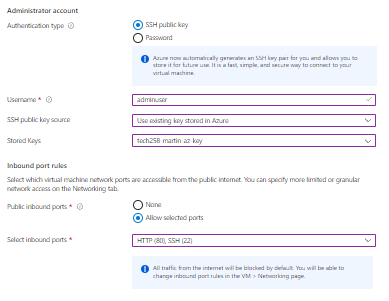
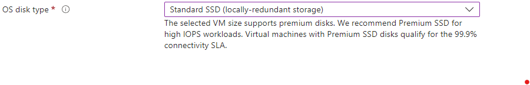
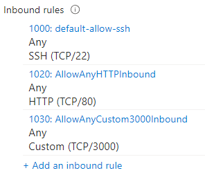
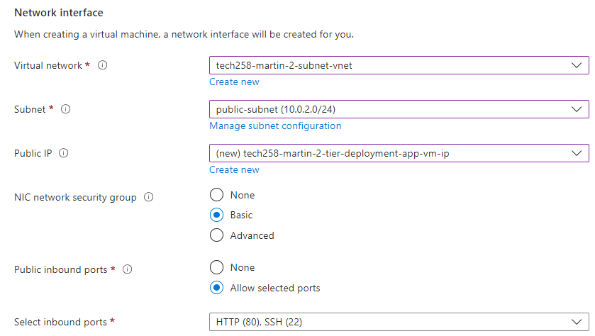
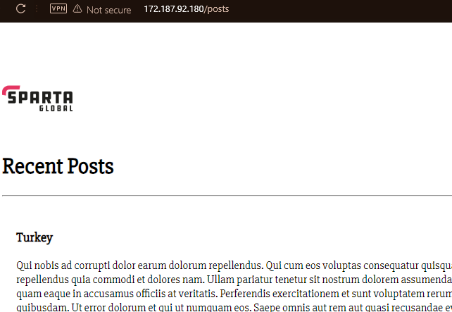

# Setting up a 2-tier app deployment on Azure
  

- Resource Groups: Organize resources into logical containers for management.
- ARM Templates: Define infrastructure and resource configurations using JSON templates.
- Deployment: Allows deploying and managing resources as a single entity.
- RBAC: Control access to resources with Role-Based Access Control.
- Tags: Organize and track resources using key-value pairs.
- Monitoring and Governance: Monitor, manage, and enforce policies for resources efficiently.

## Setting up an SSH key for Azure

Generate an SSH key in a bash terminal using the following command:

`ssh-keygen -t rsa -b 4096 -C <YOUR_EMAIL>`

To add this ssh key to Azure, search SSH into the search bar and select the SSH option. Proceed to fill out to form. Use the `cat` command in bash to view the content of the public key to use to fill the form out.

## Security
In Azure, when using Azure Cosmos DB's API for MongoDB, you do not need to declare or open port 27017 for MongoDB. Azure Cosmos DB's API for MongoDB is a fully managed service that abstracts the underlying infrastructure and networking details from you.

Azure Cosmos DB handles the management of ports, endpoints, and connectivity internally, so you can directly connect to your Azure Cosmos DB instance using the connection string provided in the Azure portal or through the SDK of your choice without worrying about port configurations.

## Setting up a VNet
 
 VNets allow you to divide your network into subnets, which can help organize and segment your resources. For example, you can have separate subnets for different tiers of your application (e.g., front-end, back-end) within the same VNet.
## Basics
Set the settings in your basic section to look as follows: 

## Networks
Set your network settings for the app as follows. 
 
Set your network settings for the database as follows. 
 
When setting up the database instance, do not set up the MongoDB port, this is mangaged for you by Azure.
## Result

## Differences Azure and AWS for setting up a 2 tier app and database deployment.
- VNet set-up.
  Azure requires you to set up a VNet while AWS uses VPC(Virtual Private Cloud).
- Subnet set-up.
  For the 2 tier app set up in AWS a subnet was not required, while in Azure it was.
- Azure Static IP
  The public IP on Azure is its own resource. When your instance is started the public IP remains the same. While on AWS it changes every time.
- Security groups.
  Azure uses Network Security Groups (NSGs) to control inbound and outbound traffic while AWS utilizes Security Groups to control traffic at the instance level.
- Tagging names.
  Azure uses tags to categorize resources for organization and management. This was not emphasised in AWS.