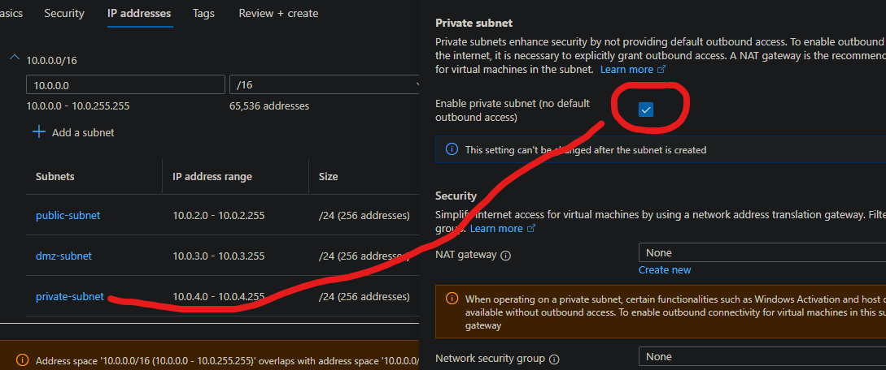
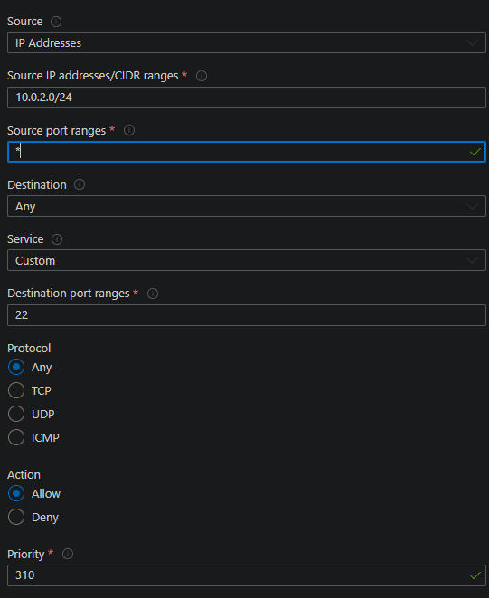

# Implementing an NVA into a 2-tier architecture on Azure to increase security of a database.

## NVA
- NVA = Network Virtual Appliance<br>

NVAs act as gateways for network traffic, allowing you to inspect, filter, and control the flow of data between different network segments. By using NVAs, you can add an extra layer of security to your network.
## DMZ
- DMZ = Demilitarised zone<br>

DMZ is a network segment that acts as a buffer zone between the internet and your internal network. It houses services that need to be publicly accessible while providing an additional layer of security by isolating them from the internal network.
## Route table
A route table in Azure is a set of rules that determine where network traffic should be directed. It acts as a map that guides traffic within a virtual network, defining paths for communication between different subnets, gateways, and virtual appliances.
## Why are things more secure this way
We can isolate network traffic which prevents traffic from reaching our databases private subnet if it is not required to go there.

Adding more layers of security is a simple way of increasing security. A DMZ is just another one of these possible layers

## How will we be implementing an NVA into our 2-tier app deployment?
.png>)


## Implementation of a NVA on App + DB deployment

### Create a new VNet
- This VNet will require 3 subnets as one will be allocated to the app, the DMZ, and the Database (in that order).<br>
    <br>
    <br>

### Run the Database and then the App
Use this [guide](https://github.com/Martin-Muraskovas/tech258_azure_linux/blob/main/userdata.md) to get your app and database running using images and userdata.

Ensure that the VNet that you use is your new 3 subnet VNet and not your previous 2 subnet VNet.

The app should use availability zone 1.<br>
The NVA should use availability zone 2.<br>
The database should use availability zone 3.

## Setting up your NVA instance
1. Create a blank instance using Ubuntu 22.04 and have port 22 enabled.
2. Go to Networking, then network settings.
3. Select your net interface.<br>
    <br>
4. Tick the IP forwarding checkbox and then save.<br>
    <br>


### Set up a route table
1. Search route tables in the Azure UI.
2. Select route tables.
3. Set up a new route table.
4. Add a route to this route table with the following parameters:


### Configuring IP forwarding within your NVA instance. 
1. SSH into your NVA instance.
2. Use the `sysctl net.ipv4.ip_forward` command to check if ip forwarding is enabled. It should not be enabled yet.
3. Access the sysctl config file using the `sudo nano /etc/sysctl.conf` command.
4. Uncomment the line `net.ipv4.ip_forward = 1`
5. Restart the process by using the `sudo sysctl -p`

### Configuring an IP table on your NVA instance.
When configuring an IP table you may lock yourself out if you don't do things carefully. You must load the rules in the right order.

Ensure you `sudo apt update -y` and `sudo apt upgrade -y` before running any scripts on your instance.

Use a script to ensure accuracy:
```
#!/bin/bash

# configure iptables

echo "Configuring iptables..."

# These commands allow traffic on the loopback interface for local communication.
sudo iptables -A INPUT -i lo -j ACCEPT
sudo iptables -A OUTPUT -o lo -j ACCEPT

# This command allows incoming traffic that is part of established connections or related to existing connections.
sudo iptables -A INPUT -m state --state ESTABLISHED,RELATED -j ACCEPT

# This command allows outgoing traffic that is part of established connections.
sudo iptables -A OUTPUT -m state --state ESTABLISHED -j ACCEPT

# This command drops incoming packets that are invalid or not part of a valid connection.
sudo iptables -A INPUT -m state --state INVALID -j DROP

# These commands allow incoming and outgoing SSH traffic on port 22.
sudo iptables -A INPUT -p tcp --dport 22 -m state --state NEW,ESTABLISHED -j ACCEPT
sudo iptables -A OUTPUT -p tcp --sport 22 -m state --state ESTABLISHED -j ACCEPT

# This command allows forwarding of SSH traffic from one subnet to another on port 27017.
sudo iptables -A FORWARD -p tcp -s 10.0.2.0/24 -d 10.0.4.0/24 --destination-port 27017 -m tcp -j ACCEPT

# Allow ICMP traffic from one subnet to another
sudo iptables -A FORWARD -p icmp -s 10.0.2.0/24 -d 10.0.4.0/24 -m state --state NEW,ESTABLISHED -j ACCEPT

# These commands set the default policies to drop for incoming and forwarded packets.
sudo iptables -P INPUT DROP
sudo iptables -P FORWARD DROP

echo "Done!"
echo ""

# make iptables rules persistent
# it will ask for user input by default

echo "Make iptables rules persistent..."
sudo DEBIAN_FRONTEND=noninteractive apt install iptables-persistent -y
echo "Done!"
echo ""

```

## Creating stricter rules on the database's network security group

- Allow SSH from public subnet <br>
<br>
- Allow Mongo DB from public subnet<br> 
<br>
- Allow ICMP from public subnet<br> 
<br>
- Deny everything else <br>
<br>
Ensure that the priority of denying everything is a larger number than the "allow" rules otherwise nothing will be allowed through.<br>


## Restricting the bind IP so that only the IPs that can send requests to the database are from the app instance.
- Configuring the bind ip so that only the app can send requests to the database is the next step in increasing security after implementing the NVA.
- To do this:
  1. SSH into your app instance
  2. While in your app instance, SSH into your database instance.
  3. Enter the following command, replacing "0.0.0.0" with the private IP of your app instance.
        -`sudo sed -i 's/bindIp: 127.0.0.1/bindIp: 0.0.0.0/g' /etc/mongod.conf`
