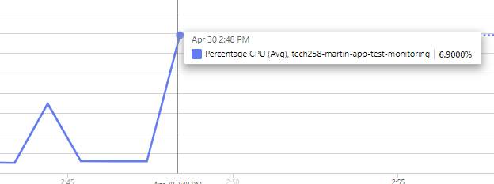

# Monitoring, Alert Management, and Autoscaling

## Autoscaling vs scaling up vs scaling down
- Autoscaling:
  - Automatically adjusts resources based on real-time demand.
  - Helps maintain performance during peak times and saves costs during low usage periods.
  - Typically used for applications with fluctuating workloads.
- Scaling up:
  - Increases the size of the existing VM to handle higher resource demands.
  - Suitable for applications that require more power but do not need additional instances.
  - May involve downtime during the scaling process.
- Scaling Down:
  - Decreases the size of the existing VM to save costs and optimize resource utilization.
  - Useful for applications that experience reduced demand and do not need excess resources.
  - Can help in cost optimization by matching resources to actual needs.
## Virtual machine availability options on Azure

- Availability sets:

- Availability zones:

- Backup and Disaster Recovery:

## Setting up a Dashboard on Azure
1. To set up our dashboard, we begin by going to our instance overview. From there we select the monitoring tab and pin one of the graphs that we would like to include in our dashboard. 
 

2. We will be creating a shared dashboard so select the shared option. 
 

3. Press edit to rearrange the dashboard how you would like it. 
 

4. Edit individual charts by selecting the context menu on the chart you want to edit.  
 

## Load testing with Apache
Use this command to install Apache Benchmark: 
`sudo apt-get install apache2-utils`
 
Use the `ab` command to load test your website. The n value is the total requests and the c value is how many requests you are making at a time.
 
`ab -n 1000 -c 100 http://20.90.163.1` 
`ab -n 10000 -c 200 http://20.90.163.1` 
 
Upon entering these commands, you can see the spikes in the monitoring line graph in our Azure dashboard.
 

## Setting up an Alert
- To create a new alert rule use this button. 
 

- Then fill out the rule conditions. In our case we want to receive an alert when the CPU usage has exceeded 6%.  
 

- Ensure that Email is selected. 
 

- Once your alert is set up. Use the ab command refered to in the apache section of this document to ensure that the CPU exceeds 6%. You will then recieve an Email once the threshold has been exceeded. 

    

