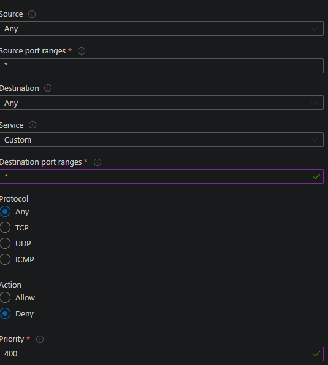
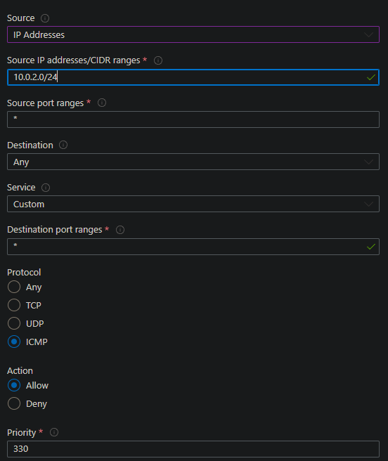

# Using User Data to set up a 2-tier deployment on Azure

## About userdata
- Runs as root user (i.e. every command will be run as sudo whether you've put sudo in the command or not).
  
- Starting file location is `/`.
  
- Only runs once immediately after VM is created.

## Setting up a 2-tier deployment
Set up your VM using this [guide](https://github.com/Martin-Muraskovas/tech258_azure_linux/blob/main/2-tier-azure-deployment.md). However before deploying, go to the advanced section and do the following. 

### userdata for the database.
 
SSH in to validate that userdata has worked.

### userdata for the app.

Check the Public IP to ensure the userdata has worked.

View public IP of app instance to validate that userdata has worked.

## Creating an Image
Follow the creating a Virtual Machine [guide](https://github.com/Martin-Muraskovas/tech258_azure_linux/blob/main/2-tier-azure-deployment.md). Set up the environment within the virtual machine so that all of the dependencies are installed. 
Use this button to begin creating an image of your VM:

## Deploying from an image.

Then create your VM as usual. You can refer to this guide to streamline the process, also you may want to refer to the userdata section of this document to automate tasks like running an application or launching a database.