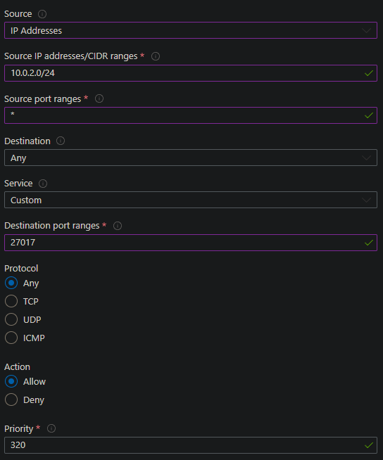

# Using User Data to set up a 2-tier deployment on Azure

## About userdata
- Runs as root user (i.e. every command will be run as sudo whether you've put sudo in the command or not).
  
- Starting file location is `/`.
  
- Only runs once immediately after VM is created.

## Setting up a 2-tier deployment
Set up your VM using this [guide](https://github.com/Martin-Muraskovas/tech258_azure_linux/blob/main/2-tier-azure-deployment.md). However before deploying, go to the advanced section and do the following. 

### userdata for the database.
 
SSH in to validate that userdata has worked.

### userdata for the app.

Check the Public IP to ensure the userdata has worked.

View public IP of app instance to validate that userdata has worked.